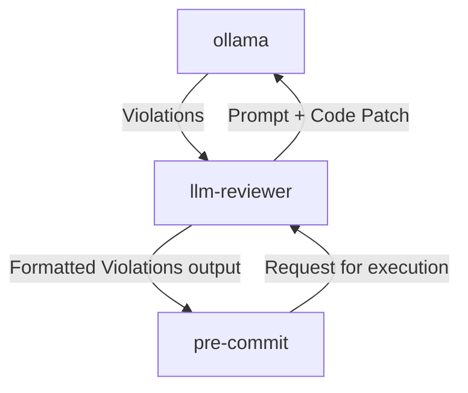
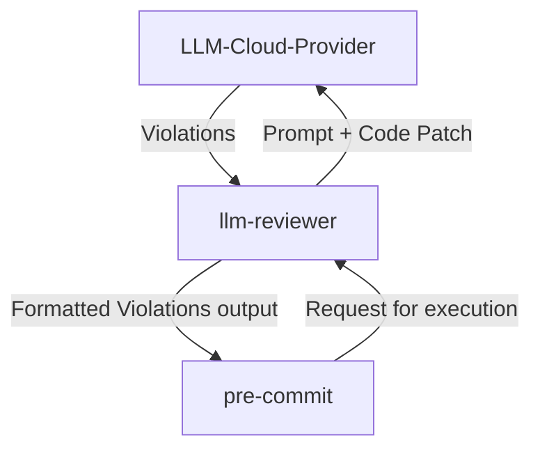

# tidy_patch

LLM based tool that suggests edits to your code patches based on your prompt style guides or checks.
This tool is by no means a replacement of static code analyzers or code format enforcers in the sense that it
will automatically and deterministically detect undesired formats. This tool is expected to reduce the burden
of code owners when reviewing patches so developers can anticipate to reviews.
You can think of this tool as another complement before making your PR/MR to reduce the back and forth with
project / team styleguide conventions. It can also help you code better documentation or enforce developers to
check function preconditions, etc. User imagination is the limit.

> [!CAUTION]
> Use with caution, this project is in very early and experimental stages.

## Description

This tool is essentially thought to work as follows:



Or alternatively:



In the future, we expect to support other workflows, like from Github Actions ([#19](https://github.com/agalbachicar/tidy_patch/issues/19)).

## Developing

### Pre-requisites

It's been developed and tested in Ubuntu 22.04, using a Lenovo Legion Pro 7i, with NVIDIA RTX 4090. So far, so good!
To fully develop on this project you need to:

- [Docker](https://docs.docker.com/engine/install/ubuntu/)
- Ubuntu 20.04 / 22.04
- NVIDIA GPU GeForce RTX 3070 or higher. At some point ([#9](https://github.com/agalbachicar/tidy_patch/issues/9)) we will integrate against cloud providers.
- [NVIDIA GPU Driver](https://www.nvidia.com/en-us/drivers/unix/)
- [NVIDIA Container Toolkit](https://github.com/NVIDIA/nvidia-container-toolkit)

### Pre-commit

Install pre-commit dependency.

```sh
pip install pre-commit
```

Install pre-commit:

```sh
pre-commit install
```

Install hadolint in Ubuntu 22.04.

> [!CAUTION]
> The following commands install `hadolint` directly into `/bin` using `sudo`. Be cautious when running commands with `sudo` as they can modify system files.

```sh
sudo wget -O /bin/hadolint https://github.com/hadolint/hadolint/releases/download/v2.12.0/hadolint-Linux-x86_64
sudo chmod +x /bin/hadolint
```

Run pre-pre-commit checks for the entire repository.

```sh
pre-commit run --all-files
```

### Virtual environment

Install [venv](https://docs.python.org/3/library/venv.html)

```sh
sudo apt-get install python3-venv
```

Create a venv:

```sh
python3 -m venv .venv
```

Source the venv:

```sh
source .venv/bin/activate
```

### Build and install

#### Build and install llm_reviewer tool

Perform the package installation in editable mode:

```sh
pip install -e .
```

#### Ollama through docker

1. Build docker images.

```sh
docker compose -f docker/docker-compose.yaml build
```

2. Run ollama service

```sh
docker compose -f docker/docker-compose.yaml up ollama -d
```

3. The first time, you can execute the following command that will pull and list your model.

```sh
$ docker exec -it ollama /usr/bin/bash -c /ollama/entrypoint.sh
++ ollama pull qwen2.5:1.5b
pulling manifest
pulling 183715c43589: 100% ▕███████████████████████████████████████████████████████████████████▏ 986 MB
pulling 66b9ea09bd5b: 100% ▕███████████████████████████████████████████████████████████████████▏   68 B
pulling eb4402837c78: 100% ▕███████████████████████████████████████████████████████████████████▏ 1.5 KB
pulling 832dd9e00a68: 100% ▕███████████████████████████████████████████████████████████████████▏  11 KB
pulling 377ac4d7aeef: 100% ▕███████████████████████████████████████████████████████████████████▏  487 B
verifying sha256 digest
writing manifest
success
++ ollama list
NAME            ID              SIZE      MODIFIED
qwen2.5:1.5b    65ec06548149    986 MB    Less than a second ago
```

### Run me!

1. Start from one of our sample configurations. Copy it to you repository using pre-commit.

```sh
cp src/llm_reviewer/config/llm-review-config.json path/to/repo/.llm-review-config.json
cp src/llm_reviewer/config/sample-pre-commit-config.yaml path/to/repo/.pre-commit-config.yaml
```

2. Source the venv, install the dependencies, and move to the target repository.

```sh
source .venv/bin/activate
pip install -e .
docker compose -f docker/docker-compose.yaml up ollama -d
cd path/to/repo
```

3. Run edit content in your target repo, add it to your staging are and run pre-commit:

```sh
echo "Hello world" > some_file
git add some_file
pre-commit run llm-pr-review --all-files
```
